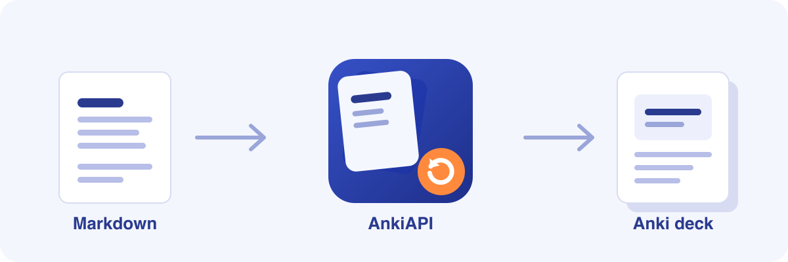

# AnkiAPI



A VS Code extension that turns a Markdown file into a live-synced Anki deck.

Write your flashcards as plain Markdown headings, hit one command, and the
extension creates/updates the matching notes in [Anki](https://apps.ankiweb.net/)
through [AnkiConnect](https://ankiweb.net/shared/info/2055492159) — including
LaTeX with reusable macros, tables for bulk card creation, and per-folder
configuration.

## Features

- **One command sync** — `Sync file with Anki` creates a deck (or binds to an
  existing one) from the file's top-level heading, then creates/updates one
  Anki note per heading.
- **Round-trip IDs** — deck and note IDs are written back into the Markdown as
  `<!--id: ...-->` comments, so re-running the sync always updates the same
  cards instead of duplicating them.
- **Orphan detection** — if a note exists in the deck but no longer has a
  matching heading (e.g. you renamed one), you're asked whether to bind it to
  an existing heading or generate a new one from its content.
- **LaTeX macros** — define `\newcommand`-style macros once in
  `ankiconfig.json` and use them in any `$...$` / `$$...$$` block; only the
  macros actually used in a given card are injected into it.
- **Nested, mergeable config** — `ankiconfig.json` files can live in parent
  folders and are merged down to the file being synced (closer folders
  override further ones), so a whole notes tree can share defaults while
  subfolders override the deck name or template.
- **Bulk cards via Markdown tables** — a table under a heading generates one
  card per row instead of one card for the whole section.
- **Editor-only extras** — while editing, the extension also registers a
  `markdown-it` plugin that expands your macros in the built-in Markdown
  preview, so what you see while writing is closer to what Anki will render.

## Requirements

- [Anki](https://apps.ankiweb.net/) with the [AnkiConnect](https://ankiweb.net/shared/info/2055492159)
  add-on installed, running in the background.
- A note type whose first two fields (by field order) are the card's front
  and back — for heading-based cards, only those two fields are filled; the
  rest are left blank. Table-based cards (see below) fill every column you
  provide.

## Configuration

Drop an `ankiconfig.json` next to your notes (or in a parent folder):

```jsonc
{
  "root": "Maths",                 // deck name prefix for files in this folder
  "template": "Basic",              // Anki note type to use
  "templateNameAsHeader": true,     // wrap the front field in <h2>...</h2>
  "parseMd": false,                 // render fields as full Markdown instead of the built-in renderer
  "macros": [
    {
      "name": "set",
      "arguments": 1,
      "content": "\\left\\{ #1 \\right\\}"
    },
    {
      "name": "setWhere",
      "arguments": 2,
      "content": "\\set{#1\\;|\\;#2}"
    }
  ]
}
```

Config files merge from the filesystem root down to the synced file, so a
subfolder only needs to override what's different (e.g. its own `root` to
nest decks, or extra `macros`).

Each macro supports:

| Field       | Type      | Meaning                                                          |
| ----------- | --------- | ----------------------------------------------------------------- |
| `name`      | `string`  | Command name, used as `\name` in LaTeX                            |
| `arguments` | `number?` | Number of `#1`, `#2`, ... placeholders in `content`                |
| `content`   | `string`  | Replacement LaTeX                                                  |
| `new`       | `boolean?`| Emit `\newcommand` (default) or `\renewcommand`                    |
| `let`       | `boolean?`| Emit `\let\name<content>` instead of a `\newcommand`               |
| `priority`  | `boolean?`| Define this macro before others in the same card (for macros that other macros depend on) |

## Writing notes

```markdown
# Linear Algebra <!--id: 1724861543064-->

## Vector space <!--id: 1724920554608-->

A set $E$ with an addition and a scalar multiplication...

## Practice <!--ignore-->

Not synced — skipped entirely.

## Definitions <!--table-->

| Term | Definition |
| ---- | ---------- |
| Basis | A linearly independent spanning family |
| Rank | The dimension of the image of a linear map |
```

Heading metadata lives in an HTML comment right after the heading text:

- `id: <number>` — Anki deck/note ID, added automatically after the first sync.
- `ignore` — skip this heading (and its content) entirely.
- `name: <text>` — use this as the card's front instead of the heading text.
- `group` — fold nested sub-headings into this card's back instead of
  treating them as separate cards.
- `table` — treat the section's Markdown table as one card per row instead of
  one card for the whole section; column headers must match the note type's
  field names.

Metadata is comma-separated (`<!--id: 1, ignore-->`), and array values use
`[a, b, c]`.

## Usage

1. Open a `.md` file.
2. Run `Sync file with Anki` from the command palette (`F1`).
3. First run: pick or create the deck to bind the file to.
4. Every run after: notes are created/updated/matched automatically.

## Links

Source, issue tracker, and build/dev instructions live on
[GitHub](https://github.com/Lucasbk38/Anki-API).

## License

[MIT](https://github.com/Lucasbk38/Anki-API/blob/master/LICENSE)
